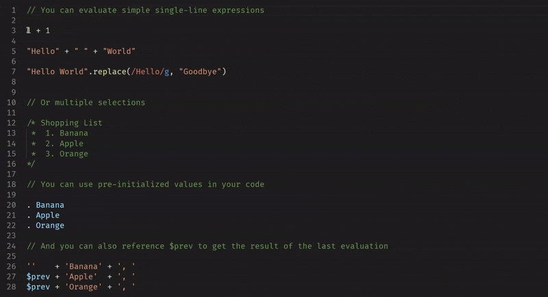

# Eval and Replace

Execute JavaScript code and replace the code with the result

[Original atom plugin](https://atom.io/packages/eval-and-replace)

[Get the extension](https://marketplace.visualstudio.com/items?itemName=Lebster.eval-and-replace)

## Demo

## Usage
You can execute any JavaScript code by first selecting it and then running `Eval and Replace: JS` from the command palette (or by selecting it and using the default keybinding, <kbd>Ctrl</kbd> + <kbd>Shift</kbd> + <kbd>J</kbd>)

## Multiple selections & pre-initialized values
You can evaluate multiple expressions selected seperately, and each will be replaced seperately, however: the same context is used for all selections, so you can reuse variables. 

Additionally you have access to these pre-initialized global functions and variables:

* `i`, `j`, `n`, `x`, `y`, `z`: initialized with `0`
* `a`, `s`: initialized with `''`
* `PI`: Alias for `Math.PI` (etc. for other `Math` properties & methods)
* `randomInt(min: number, max: number)`: generates a random integer between `min` and `max` (inclusive of both)

Note that you can add your own custom pre-initialized data through the `eval-and-replace.preinitializedScript` setting.

If you have any questions / concerns about this extension, reach out to me on Discord at `lebster`

## [Change Log](CHANGELOG.md)

**Enjoy!**