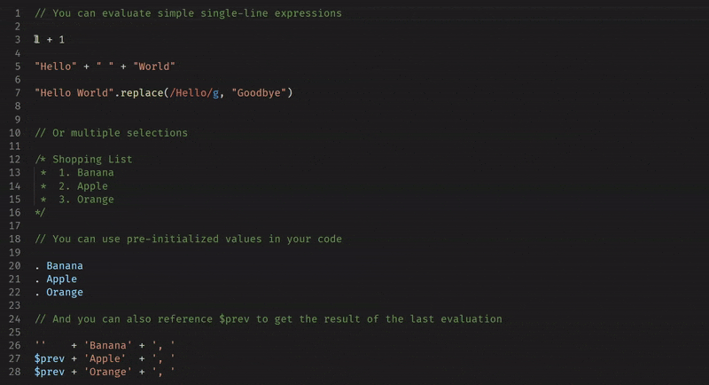

# Eval and Replace

Execute CoffeeScript or JavaScript code from the editor and replace the code with the result.

[Original atom plugin](https://atom.io/packages/eval-and-replace)

[Get the extension](https://marketplace.visualstudio.com/items?itemName=Lebster.eval-and-replace)

## Demo

### Single line expressions
You can evaluate any expression by selecting it and running

`Eval and replace: Js` if you want to run it as JavaScript

or

`Eval and replace: Coffee` if you to run it as CoffeeScript

### Multiple selections & pre-initialized values
You can evaluate multiple expressions selected seperately, and each will be replaced seperately, however: the same context is used for all selections, so you can reuse
variables. Additionally you have access to these pre- initialized functions and variables:

* `i`, `j`, `n`, `x`, `y`, `z`: initialized with `0`
* `a`, `s`: initialized with `''`
* `PI`: alias for `Math.PI`
* `E`: alias for `Math.E`
* `random()`: alias for `Math.random()`
* `randomInt(min, max)`: generates a random integer between `min` and `max` (inclusive)
* `pow()`: alias for `Math.pow()`
* `sqrt()`: alias for `Math.sqrt()`
* `abs()`: alias for `Math.abs()`
* `sin()`: alias for `Math.sin()`
* `cos()`: alias for `Math.cos()`
* `tan()`: alias for `Math.tan()`
* `floor()`: alias for `Math.floor()`
* `ceil()`: alias for `Math.ceil()`
* `round()`: alias for `Math.round()`

## Extension Settings

This extension contributes the following settings:

* `eval-and-replace.debug-time`   : Show execution time
* `eval-and-replace.force-replace`: Replace the selected text even if the code resulted in an error.

## Release Notes

### 1.0.0

- Initial release

**Enjoy!**
